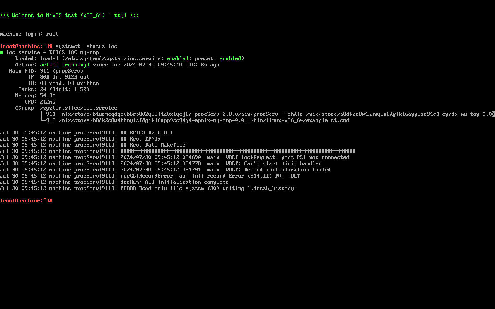
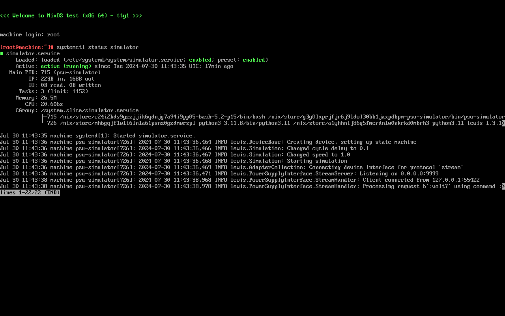

Adding integration tests to your IOC
====================================

.. note::
   This tutorial is a continuation of the :doc:`streamdevice` tutorial.

   If you haven't already, follow the StreamDevice tutorial first.

In this tutorial,
you'll learn how to test your created StreamDevice IOC
by running it against the simulator,
inside a declared NixOS VM,
and checking that it behaves as expected.

This method of testing can then be automated
by running it inside a Continuous Integration (CI) system.

Pre-requisites
--------------

.. warning::
   Nix assumes you can run hardware-accelerated VMs,
   through KVM.

Make sure that you have KVM on your Linux machine
by checking if the file :file:`/dev/kvm` is present.

If the file is present,
you can proceed to the next section.

If you don't have KVM,
and you're running Nix on a physical machine,
examine your firmware settings
to see if you can enable hardware-accelerated virtualization.
The setting can show up as:

- Virtualization
- Intel Virtualization Technology
- Intel VT
- VT-d
- SVM Mode
- AMD-v

If you don't have KVM,
and you're running Nix on a virtual machine,
check your firmware settings
as said before,
and look up your hypervisor documentation
to enable nested virtualization.

If this doesn't work,
you can still proceed without hardware acceleration
by adding this line to your :file:`nix.conf`:

.. code-block::
   :caption: :file:`/etc/nix/nix.conf`

   extra-system-features = kvm

Note that this means much slower integration tests.

Writing the test
----------------

Through the `NixOS testing framework`_,
EPNix provides a way of specifying a machine configuration,
and running a Python script that can do various kinds of testing.

With your IOC created during the :doc:`streamdevice` tutorial,
you'll see a :file:`checks/` directory,
which is the place to add your integration tests.

These tests are imported using the :ref:`opt-epnix.checks.imports` option.

For example,
in the EPNix template,
you'll see in your :file:`flake.nix` file:

.. code-block:: nix
   :caption: :file:`flake.nix`: importing an integration test

   checks = {
     simple = pkgs.callPackage ./checks/simple.nix {};
   };

The :file:`./checks/simple.nix` file should contain a NixOS test such as this:

.. code-block:: nix
   :caption: :file:`checks/simple.nix`: structure of a test

   { nixosTest, epnix, ... }:

   nixosTest {
     name = "simple";

     nodes.machine = {
       # Description of the NixOS machine...
     };

     testScript = ''
       # Python script that does the testing...
     '';
   }

Running this test creates a NixOS virtual machine
from the given configuration,
and runs the test script.

The test script can,
among other things,
run commands on the machine,
start,
shut down,
or reboot the machine.

.. tip::
   The Python test script doesn't run *on* the virtual machine,
   but communicates with it.

   If you want to run Python code on the VM machine,
   you need to package it and run it as a command.

For a more detailed overview of what you can put in the machine configuration,
examine the `NixOS documentation`_,
or the :doc:`../../nixos-services/tutorials/archiver-appliance` tutorial.

.. _NixOS testing framework: https://nixos.org/manual/nixos/stable/index.html#sec-nixos-tests
.. _NixOS documentation: https://nixos.org/manual/nixos/stable/index.html#sec-configuration-syntax

Starting your IOC through systemd
---------------------------------

First, you need to ensure that your IOC will start inside the VM.

In the default template,
you'll see this particular configuration:

.. code-block:: nix
   :caption: :file:`checks/simple.nix`: config for starting an IOC

     nodes.machine = {
       imports = [
         epnixLib.nixosModule

         # Import the IOC service,
         # as defined in flake.nix' nixosModules.iocService
         iocService
       ];

       environment.systemPackages = [epnix.epics-base];
     };

The import of ``epnixLib.nixosModule`` enables you
to use the EPNix NixOS modules.
For example,
these modules define the :nix:option:`services.iocs` options
which are used in this test.

The import of ``iocService``
imports the NixOS module defined in :file:`flake.nix`,
under ``nixosModules.iocService``.
This module uses the :nix:option:`services.iocs` options
to define a systemd service that will run your IOC.
For more information about these options,
see :doc:`../../nixos-services/user-guides/ioc-services`.

Make sure your definitions are correct in your :file:`flake.nix`:

.. code-block:: nix
   :caption: :file:`flake.nix`: configuring the iocBoot folder for the test systemd service
   :emphasize-lines: 5-6

         nixosModules.iocService = {config, ...}: {
           services.iocs.myIoc = {
             description = "An optional description of your IOC";
             package = self.packages.x86_64-linux.default;
             # Directory where to find the 'st.cmd' file
             workingDirectory = "iocBoot/iocMyIoc";
           };
         };

Back in :file:`checks/simple.nix`,
also take note of the package :ref:`pkg-epics-base` being installed
with the ``environment.systemPackages`` option.
This enables you to use the :command:`caget`, :command:`caput` commands
inside the VM.

.. _run-test:

Running the test
----------------

To run the tests,
run this command:

.. code-block:: bash
   :caption: Running all tests

   nix flake check -L

If you left the test script as-is,
you should see that the test fails.
That's because the test script is currently not adapted to our IOC.

We'll change it afterward,
but for now in the logs you should see your IOC being run.

If you have several tests
and you want to run a specific one,
you can run:

.. code-block:: bash
   :caption: Running the test "simple"

   nix build -L '.#checks.x86_64-linux.simple'

.. _run-driverInteractive:

Running the test interactively
------------------------------

It's often desirable to run the VM interactively,
to figure out what works and what doesn't,
before writing the test.

To do so,
run:

.. code-block:: bash
   :caption: Running the test "simple" interactively

   nix run -L '.#checks.x86_64-linux.simple.driverInteractive'

This runs a Python shell prompt in the same environment as the test script.
Any command run here is the same as running it in the test script,
but interactively.

You can use the ``start_all()`` functions
to start all VMs that you declared in ``nodes``:

.. code-block:: pycon

   >>> start_all()

In our case,
we only defined ``machine``,
so this starts a single VM,
and runs your IOC inside it.

You can log in to that VM with the user ``root`` and no password.
You can then run any command you want
to inspect the state of the VM.

   Integration VM screenshot showing the IOC running

.. tip::
   If you have a non-English-language keyboard,
   change your keyboard layout inside the VM by using :command:`loadkeys`.

   For example,
   to set the keyboard to "french":

   .. code-block:: console

      [root@machine:~]# loadkeys fr

.. tip::
   To exit the Python shell prompt,
   press :kbd:`Ctrl-d`, then :kbd:`y`.

   Exiting the Python shell prompt automatically shuts down the VMs.

Adding the simulator
--------------------

The simulator is a program listening on port 9999.
Inside the test VM,
it should be a program run by a systemd service.

Same as the IOC,
you should use the ``systemd.services`` options.

Change your Nix test file like this:

.. code-block:: nix
   :caption: Adding the simulator as systemd service,
    important changes emphasized
   :emphasize-lines: 1,10-13

     nodes.machine = {lib, ...}: {
       imports = [
         epnixLib.nixosModule

         # Import the IOC service,
         # as defined in flake.nix' nixosModules.iocService
         iocService
       ];

       systemd.services.simulator = {
         serviceConfig.ExecStart = lib.getExe epnix.psu-simulator;
         wantedBy = ["multi-user.target"];
       };

       environment.systemPackages = [epnix.epics-base];
     };

The first emphasized line is about adding the ``lib`` argument used below.

The second set of emphasized lines is about creating the ``simulator.service`` systemd service. These lines will generate the following service file:

.. code-block:: dosini
   :caption: generated :file:`/etc/systemd/system/simulator.service`

   [Unit]

   [Service]
   # ...
   ExecStart=/nix/store/...-psu-simulator/bin/psu-simulator

And this service is automatically started at boot,
by being a dependency of ``multi-user.target``.

The ``serviceConfig`` option adds configuration keys to the ``[Service]`` section.
Here,
we set ``ExecStart`` to main executable program of the ``psu-simulator`` package,
by using the ``lib.getExe`` function.

A ``unitConfig`` for the ``[Unit]`` section also exists.

The ``[Install]`` section isn't present in NixOS,
because managed differently,
by using options such as ``wantedBy``, ``requiredBy``, etc.

For more information,
see the `systemd.services`_ options in the NixOS manual.

.. _systemd.services: https://nixos.org/manual/nixos/stable/options#opt-systemd.services

----

With this configuration,
you can run the VM interactively
(see :ref:`run-driverInteractive`),
and you should see the simulator up and running after booting.

.. tip::
   If you make changes to your configuration,
   or your IOC,
   you *don't* need to rebuild anything
   before running the ``nix run`` command.

   Nix will by itself figure out what it needs to rebuild,
   and rebuild it before running the test.

   Integration VM screenshot showing the simulator running

Writing the test
----------------

Now that the VM configuration is appropriate,
you can start writing your test script.

Here is a sample of useful Python functions:

.. py:function:: start_all()

   Start all defined VMs

.. py:function:: Machine.wait_for_unit(self, unit: str, user: str | None = None, timeout: int = 900)

   Wait for a systemd unit to get into “active” state.
   Throws exceptions on “failed” and “inactive” states
   as well as after timing out.

   .. code-block:: python
      :caption: Example

      machine.wait_for_unit("ioc.service")

.. py:function:: Machine.succeed(self, command: str, timeout: int | None = None)

   Execute a shell command,
   raising an exception if the exit status is not zero,
   otherwise returning the standard output

   .. code-block:: python
      :caption: Example

      machine.succeed("caput VOLT 42")

.. py:function:: Machine.wait_until_succeeds(self, command: str, timeout: int = 900)

   Repeat a shell command with 1-second intervals until it succeeds.

   Be careful of the ``s`` in ``succeeds``.

   .. code-block:: python
      :caption: Example

      machine.wait_until_succeeds("caget -t my:stringout | grep -qxF 'expected value'")

.. py:function:: Machine.fail(self, command: str, timeout: int | None = None)

   Like :py:func:`succeed`,
   but raising an exception if the command returns a zero status.

   .. code-block:: python
      :caption: Example

      machine.fail("caget unknown-PV")

.. py:function:: Machine.wait_for_open_port(self, addr: int | str, timeout: int = 900)

   Wait until a process is listening on the given TCP port and IP address (default ``localhost``).

   .. code-block:: python
      :caption: Example

      machine.wait_for_open_port(9999)

.. py:function:: retry(fn: Callable, timeout: int = 900)

   Call the given function repeatedly, with 1-second intervals,
   until it returns ``True`` or a timeout is reached.

   .. code-block:: python
      :caption: Example

      def check_value(_last_call: bool) -> bool:
          """Check whether the VOLT-RB PV is 42."""
          value = float(machine.succeed("caget -t VOLT-RB"))
          return value == 42.

      retry(check_value, timeout=10)

.. py:function:: subtest(name: str)

   Group logs under a given test name.

   To be used with the ``with`` syntax.

   .. code-block:: python
      :caption: Example

      with subtest("check voltage"):
          test_setting_voltage()
          test_voltage_readback()
          ...

You can also read more about the Python functions available in the test script
in the `NixOS tests documentation`_.

.. _NixOS tests documentation: https://nixos.org/manual/nixos/stable/index.html#sec-nixos-tests

Example test script
^^^^^^^^^^^^^^^^^^^

Here an example test script
that should work with your StreamDevice IOC:

.. code-block:: python
   :caption: :file:`checks/simple.nix`: Example test script

   start_all()

   with subtest("check services"):
       machine.wait_for_unit("ioc.service")
       machine.wait_for_unit("simulator.service")
       machine.wait_for_unit("default.target")

       machine.wait_for_open_port(9999)

   # Prefer using 'wait_until_succeeds',
   # since the 'ioc.service' being active doesn't necessarily means
   # that the IOC is initialized
   machine.wait_until_succeeds("caget VOLT-RB", timeout=10)
   machine.fail("caget unknown-PV")

   with subtest("check voltage"):
       # Initial value is zero
       machine.succeed("caget -t VOLT-RB | grep -qxF '0'")

       machine.succeed("caput VOLT 42")

       def check_value(_last_call: bool) -> bool:
           """Check whether the VOLT-RB PV is 42."""
           value = float(machine.succeed("caget -t VOLT-RB"))
           return value == 42.

       retry(check_value, timeout=10)

Note that the script uses the ``wait_until_succeeds`` method and the ``retry`` function.
This is because EPICS has few guarantees about whether it propagates changes immediately.
It’s better to encourage the use of retries,
instead of hoping the timing lines up.

After changing your test script,
run your test as explained in :ref:`run-test`.

Next steps
----------

You can examine other NixOS test examples:

- In the `EPNix' ioc/tests`_ folder, for IOC tests,
- In the `EPNix' nixos/tests`_ folder, for EPICS-related NixOS services tests,
- Or in the `nixpkgs' nixos/tests`_ folder.

If you'd like to run a complete python script on the test VM,
which can use Python dependencies such as ``pyepics``,
examine the guide :doc:`../user-guides/testing/packaging-python-scripts`.

If you're interested in adding unit tests,
examine the :doc:`../user-guides/testing/unit-testing` guide.

For all testing related guides,
see :doc:`../user-guides/testing/index`.

.. _EPNix' ioc/tests: https://github.com/epics-extensions/epnix/tree/master/ioc/tests
.. _EPNix' nixos/tests: https://github.com/epics-extensions/epnix/tree/master/nixos/tests
.. _nixpkgs' nixos/tests: https://github.com/NixOS/nixpkgs/tree/master/nixos/tests
